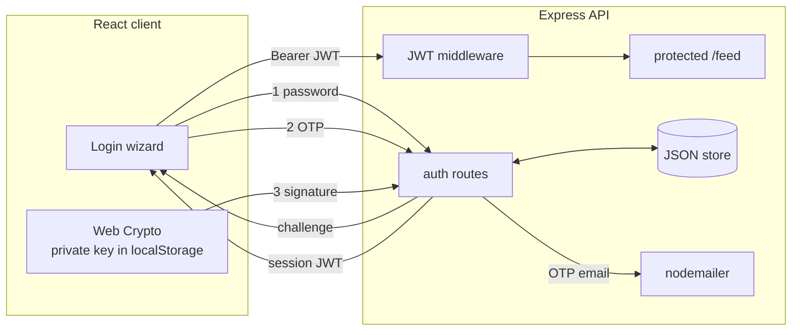

# Triple Factor Authentication for Social Media — Project Report

## Abstract

Password-only authentication remains the weakest link in social-media security:
credentials are phished, reused, and leaked at scale. This project designs and
implements a **triple-factor authentication (3FA)** sign-in flow that combines
three *independent* factors — a knowledge factor (password), a possession factor
delivered out-of-band (email one-time password), and a cryptographic possession
factor (a device-bound key proven via a challenge–response signature). Only when
all three succeed does the server issue a **JSON Web Token (JWT)** granting access
to protected resources. The system is implemented as a Node.js/Express API and a
React client, and is validated with an automated end-to-end test including an
attack (forged-signature) case.

---

## 1. Introduction

Authentication factors are traditionally grouped into three categories:

- **Knowledge** — something the user *knows* (password, PIN).
- **Possession** — something the user *has* (phone, hardware key).
- **Inherence** — something the user *is* (biometrics).

Multi-factor authentication (MFA) strengthens security by requiring more than one
category, so that compromising a single secret is insufficient. This project
implements **three** factors, deliberately spanning two categories with an extra,
cryptographically strong possession factor:

1. **Password** (knowledge).
2. **Email OTP** (possession — proven by control of an email inbox).
3. **Cryptographic challenge–response** (possession — proven by holding a private
   key that never leaves the device).

The third factor is the project's novel core: rather than another shared secret,
it uses **public-key cryptography**, so the server stores nothing that could be
replayed if the database leaked.

---

## 2. Objectives

- Require three independent factors before any session is granted.
- Ensure no factor can be skipped or reordered by a malicious client.
- Store no reusable secrets in plaintext (passwords, OTPs, private keys).
- Issue and validate stateless sessions with JWT.
- Provide a working, testable demonstration with a clean UX.

---

## 3. Technology stack

| Layer | Choice | Reason |
|-------|--------|--------|
| Backend | Node.js + Express | Lightweight HTTP API |
| Password hashing | bcryptjs | Salted, slow hash; pure-JS (no native build) |
| Sessions / stage tokens | jsonwebtoken | Standard, stateless JWT |
| OTP email | nodemailer (Ethereal/SMTP) | Zero-config test inbox or real SMTP |
| Third factor | Node `crypto` + Web Crypto | ECDSA P-256 sign/verify, no libraries |
| Storage | JSON-file store | No external DB needed for a demo |
| Frontend | React + Vite | Component-based multi-step wizard |

A design constraint was **portability**: avoiding natively-compiled dependencies
so the project runs on any machine with only Node installed.

---

## 4. System architecture



The client holds the private key; the server holds only the public key, password
hash, and transient (hashed) OTP and challenge values.

---

## 5. Authentication flow

```mermaid
sequenceDiagram
  participant U as User (browser)
  participant S as Server
  Note over U,S: Registration
  U->>U: Generate ECDSA P-256 key pair
  U->>S: register(username, email, password, publicKey)
  S->>S: bcrypt(password); store user + publicKey

  Note over U,S: Factor 1 — Password
  U->>S: POST /login/password
  S->>S: bcrypt.compare
  S-->>U: stageToken(stage=otp) + email OTP

  Note over U,S: Factor 2 — Email OTP
  U->>S: POST /login/otp (stageToken, otp)
  S->>S: verify OTP hash + expiry
  S-->>U: stageToken(stage=challenge) + random challenge

  Note over U,S: Factor 3 — Crypto challenge
  U->>U: sign(challenge) with private key
  U->>S: POST /login/challenge (stageToken, signature)
  S->>S: crypto.verify(publicKey, challenge, signature)
  S-->>U: session JWT

  Note over U,S: Access
  U->>S: GET /feed (Bearer JWT)
  S-->>U: protected data
```

### 5.1 Stage tokens prevent factor-skipping

Between factors the server issues a short-lived **stage token** — a JWT of type
`stage` carrying the current `stage` value (`otp`, then `challenge`). Each
endpoint verifies both the signature *and* that the token is at the expected
stage. Because the token is signed with the server secret, a client cannot forge
one to jump straight to the final step. Stage tokens expire in 5 minutes.

---

## 6. The three factors in detail

### 6.1 Factor 1 — Password (knowledge)
Passwords are hashed with **bcrypt** (cost factor 10) and never stored in
plaintext. Login uses a constant comparison path and a single generic error
("Invalid username or password") to avoid user-enumeration leaks.

### 6.2 Factor 2 — Email OTP (possession)
On password success the server generates a cryptographically random 6-digit code
(`crypto.randomInt`), stores only its **SHA-256 hash** with a 5-minute expiry,
and emails the plaintext code. Verification is **single-use** (the stored OTP is
cleared on the first check) and uses a constant-time comparison
(`crypto.timingSafeEqual`).

### 6.3 Factor 3 — Cryptographic challenge–response (possession)
At registration the client generates an **ECDSA P-256** key pair using the Web
Crypto API. The private key is stored only in the browser; the public key (as a
JWK) is registered on the server. At login the server issues a random 32-byte
**challenge** (nonce). The client signs it with the private key; the server
verifies the signature against the stored public key.

Key properties:
- The private key is **never transmitted** — the server cannot impersonate the
  user even if fully compromised.
- The challenge is **single-use** and **time-bound** (5 min), defeating replay.
- Web Crypto emits IEEE-P1363 (raw `r‖s`) signatures; the server verifies with
  Node's `dsaEncoding: 'ieee-p1363'` option for interoperability.

---

## 7. Session management with JWT

Only after all three factors pass does the server sign a **session JWT** (type
`session`) containing the user id and username, with a configurable lifetime
(default 1 hour). Protected routes are guarded by middleware that requires a
valid `Bearer` session token. Stateless JWTs mean the server keeps no session
table; the token itself is the proof of a completed 3FA login.

---

## 8. Threat model & security analysis

| Threat | Mitigation |
|--------|------------|
| Password leak / reuse | bcrypt hashing; password alone is insufficient (2 more factors) |
| Phishing a single secret | Three independent factors across channels |
| Database compromise | Only hashes and a **public** key are stored — none are reusable |
| OTP interception / replay | Single-use, hashed at rest, 5-minute expiry, constant-time compare |
| Challenge replay | Random single-use nonce, time-bound |
| Skipping/reordering factors | Signed, staged, short-lived stage tokens |
| Session forgery | JWT signed with server secret; typed tokens (`stage` vs `session`) |
| User enumeration | Generic auth error message |

### Assumptions
The TLS transport layer is assumed (HTTPS in deployment), and the user's device
storing the private key is assumed uncompromised.

---

## 9. Limitations & future work

- **Key portability.** The private key lives in one browser's `localStorage`; a
  real product would use WebAuthn / hardware authenticators or an encrypted
  key-backup flow so users can log in across devices.
- **Storage.** The JSON-file store is for demonstration; production needs a real
  database with proper concurrency and backups.
- **Rate limiting & lockout.** Add throttling and account lockout on repeated
  password/OTP failures.
- **Token revocation.** Stateless JWTs cannot be revoked before expiry; add a
  refresh-token + denylist model for real deployments.
- **Biometric (inherence) factor.** Could replace or augment a possession factor
  via WebAuthn platform authenticators.

---

## 10. Conclusion

The project delivers a working triple-factor authentication system for a
social-media context, layering a knowledge factor, an out-of-band possession
factor, and a cryptographic possession factor, with JWT-based sessions issued
only after all three succeed. The design stores no reusable secrets in a
recoverable form and prevents factor-skipping through signed stage tokens. An
automated end-to-end test — including a forged-signature attack case — confirms
the intended behaviour. The identified limitations map a clear path from this
educational prototype toward a production-grade authentication service.

---

## Appendix A — API reference

| Method & path | Purpose | Returns |
|---------------|---------|---------|
| `POST /api/auth/register` | Create account (password hash + public key) | 201 |
| `POST /api/auth/login/password` | Factor 1; emails OTP | stage token (otp) |
| `POST /api/auth/login/otp` | Factor 2 | stage token (challenge) + nonce |
| `POST /api/auth/login/challenge` | Factor 3 | **session JWT** |
| `GET /api/feed` | Protected resource | feed (requires Bearer JWT) |
| `GET /api/me` | Current user | id + username |
| `GET /api/health` | Health check | `{ ok: true }` |

## Appendix B — Running the tests

```bash
cd backend
DEV_RETURN_OTP=1 npm start   # terminal 1
node smoke-test.js           # terminal 2
```

Expected output ends with `🎉 All checks passed.`, including
`negative test: forged signature correctly rejected (401)`.
